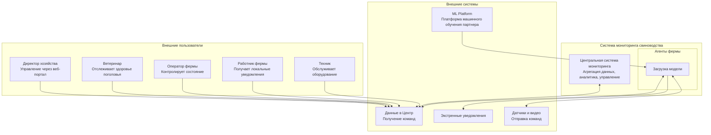
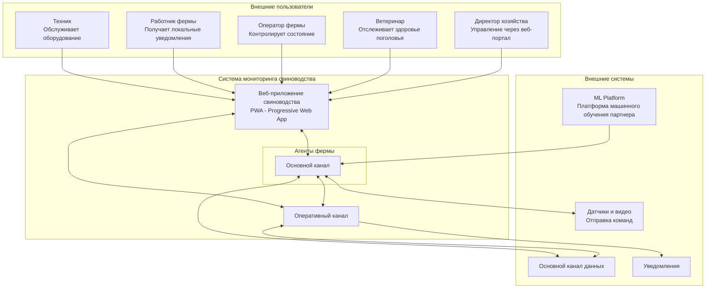

### **Название задачи:** Разработка вариантов решений
### **Автор:** Гуреев Евгений
### **Дата:** октябрь 2025
### **Функциональные требования**

|**№**|**Действующие лица или системы**|**Use Case**|**Описание**|
| :-: | :- | :- | :- |
|1|Система видеоаналитики, Оператор|Фиксация беспокойного поведения животных|Система анализирует видео в реальном времени, выявляет признаки драк или беспокойства и автоматически уведомляет оператора|
|2|Система видеоаналитики, Оператор|Фиксация задавливания поросят|ML-модель идентифицирует случаи задавливания и немедленно оповещает оператора для вмешательства|
|3|Агент фермы, Контроллеры кормушек|Управление кормушками и поилками|Система отправляет команды контроллерам кормушек и поилок различных производителей для автоматизации кормления|
|4|Система видеоаналитики, Ветеринар|Оценка состояния животных|Анализ внешнего вида и поведения животных для выявления болезней, гибели, беспокойства и других состояний|
|5|Датчики фильтрации, Техник|Мониторинг систем фильтрации воды|Отслеживание состояния фильтров и своевременное оповещение о необходимости обслуживания|
|6|Система видеоаналитики, ERP|Пересчет поголовья|Автоматический подсчет животных с передачей данных в ERP-систему|
|7|Датчики кормохранилищ, Планировщик|Мониторинг запасов еды|Отслеживание остатков кормов и прогнозирование расхода на основе аналитики|
|8|Камеры разных производителей|Поддержка видеокамер|Интеграция с камерами различных производителей для аналитики в реальном времени|
|9|Агент фермы, Центральная система|Автономная работа|Функционирование системы при отсутствии интернета с последующей синхронизацией|
|10|Все пользователи|Аутентификация и авторизация|Поддержка современных методов аутентификации с разделением ролей|
|11|Агент фермы, Центральная система|API для создания мобильного приложения или веб-приложения|Аутентификация клиентов, предоставление базовых метрик, создание кастомных метрик, управление сценариями автоматизации и оповещения, получение уведомлений|

### **Нефункциональные требования**

|**№**|**Требование**|
| :-: | :- |
|1|Отказоустойчивость 99.95%|
|2|Расширяемость архитектуры|
|3|Время оповещения о нештатной ситуации ≤5 секунд|
|4|Реакция системы видеоаналитики в реальном времени (миллисекунды)|
|5|Поддержка задержки синхронизации до 10 минут|
|6|Работа в условиях нестабильного WiFi|
|7|Автономная работа при потере связи|

### **Решение**

#### Контекстная диаграмма основного решения ####

PlantUML: 
[C1_Main.puml](C1_Main.puml)

Mermaid:

#### Обоснование основного решения:

Основное решение построено по принципу интеграции с существующей IT-инфраструктурой компании "АгроПром Х". Ключевые архитектурные решения:
1. Использование существующей платформы для минимизации затрат на разработку и интеграцию
2. Архитектура "центральный сервер - агенты" обеспечивает автономность работы на фермах
3. Локальная обработка данных на агентах фермы позволяет работать при отсутствии интернета
4. Интеграция через Apache Kafka обеспечивает надежную асинхронную коммуникацию
5. Использование ClickHouse для хранения временных рядов и аналитики
6. Существующее мобильное приложение расширяется новым функционалом
7. Существующей сайт расширяется новым функционалом
8. Возможность доставки экстренных оповещений через альтернативные каналы - push

Преимущества:
- Минимальные затраты на интеграцию
- Использование проверенных технологий
- Быстрый запуск MVP
- Снижение рисков за счет использования существующей инфраструктуры

### **Альтернативы**

#### Контекстная диаграмма основного решения ####

PlantUML: 
[С1_Alternative.puml](С1_Alternative.puml)

Mermaid:

#### Обоснование альтернативного решения:

Обоснование альтернативного решения:
1. Создание специализированного PWA веб-приложения
2. PWA-технологии позволяют установить приложение на устройства и работать оффлайн
3. PWA веб-приложение в дальнейшем может стать основой для мобильного приложения
3. Прямое взаимодействие между приложением и агентами фермы для уменьшения задержек
4. Резервные каналы связи между компонентами системы
5. Специализированный интерфейс оптимизированный для задач свиноводства

Преимущества:
- Специализированный пользовательский опыт
- Лучшая производительность за счет прямых соединений
- Независимость от эволюции основной платформы
- Современные PWA-технологии

**Недостатки, ограничения, риски**

#### Основное решение:

Недостатки:
- Зависимость от существующей платформы и ее ограничений
- Менее специализированный интерфейс для свиноводства
- Возможные задержки из-за дополнительного уровня интеграции
- Необходимость доработки существующего мобильного приложения и сайта

Риски:
- Ограничения существующей инфраструктуры могут повлиять на производительность
- Сложности с кастомизацией под специфические требования свиноводства

Компромиссы:
- Принята зависимость от существующей платформы ради скорости разработки
- Использование существующих каналов уведомлений вместо специализированных

#### Альтернативное решение:

Недостатки:
- Высокие первоначальные затраты на разработку
- Сложность поддержки двух независимых систем

Риски:
- Потенциальные проблемы с синхронизацией данных между системами
- Необходимость обучения пользователей новому интерфейсу

Компромиссы:
- Создании отдельного приложения для лучшего UX
- Использование PWA как компромисс между веб- и нативными приложениями

#### Рекомендация:

Для MVP рекомендуется основное решение как более быстрое в реализации и менее рискованное, с возможностью эволюции в сторону альтернативного решения по мере роста бизнес-потребностей.

