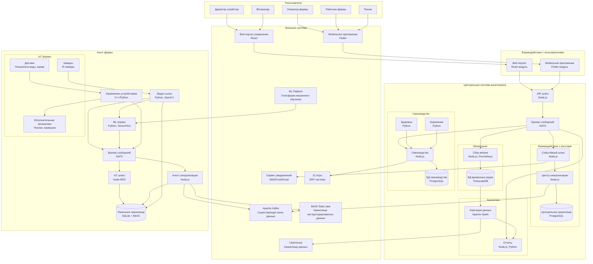

### **Название задачи:** Проработка высокоуровневого видения решений
### **Автор:** Гуреев Евгений
### **Дата:** октябрь 2025
### **Функциональные требования**

|**№**|**Действующие лица или системы**|**Use Case**|**Описание**|
| :-: | :- | :- | :- |
|1|Система видеоаналитики, Оператор|Фиксация беспокойного поведения животных|Система анализирует видео в реальном времени, выявляет признаки драк или беспокойства и автоматически уведомляет оператора|
|2|Система видеоаналитики, Оператор|Фиксация задавливания поросят|ML-модель идентифицирует случаи задавливания и немедленно оповещает оператора для вмешательства|
|3|Агент фермы, Контроллеры кормушек|Управление кормушками и поилками|Система отправляет команды контроллерам кормушек и поилок различных производителей для автоматизации кормления|
|4|Система видеоаналитики, Ветеринар|Оценка состояния животных|Анализ внешнего вида и поведения животных для выявления болезней, гибели, беспокойства и других состояний|
|5|Датчики фильтрации, Техник|Мониторинг систем фильтрации воды|Отслеживание состояния фильтров и своевременное оповещение о необходимости обслуживания|
|6|Система видеоаналитики, ERP|Пересчет поголовья|Автоматический подсчет животных с передачей данных в ERP-систему|
|7|Датчики кормохранилищ, Планировщик|Мониторинг запасов еды|Отслеживание остатков кормов и прогнозирование расхода на основе аналитики|
|8|Камеры разных производителей|Поддержка видеокамер|Интеграция с камерами различных производителей для аналитики в реальном времени|
|9|Агент фермы, Центральная система|Автономная работа|Функционирование системы при отсутствии интернета с последующей синхронизацией|
|10|Все пользователи|Аутентификация и авторизация|Поддержка современных методов аутентификации с разделением ролей|
|11|Агент фермы, Центральная система|API для создания мобильного приложения или веб-приложения|Аутентификация клиентов, предоставление базовых метрик, создание кастомных метрик, управление сценариями автоматизации и оповещения, получение уведомлений|

### **Нефункциональные требования**

|**№**|**Требование**|
| :-: | :- |
|1|Отказоустойчивость 99.95%|
|2|Расширяемость архитектуры|
|3|Время оповещения о нештатной ситуации ≤5 секунд|
|4|Реакция системы видеоаналитики в реальном времени (миллисекунды)|
|5|Поддержка задержки синхронизации до 10 минут|
|6|Работа в условиях нестабильного WiFi|
|7|Автономная работа при потере связи|

### **Решение**

#### Контекстная диаграмма основного решения ####

PlantUML: 
[C2_Main.puml](C2_Main.puml)

Mermaid:

#### Обоснование основного решения:

Архитектура основного решения построена на принципах интеграции с существующей инфраструктурой и обеспечения автономности работы ферм:

Использование NATS core как основного брокера сообщений для обеспечения высокой производительности и низкой задержки
1. Использование существующей систему аутентификации
2. Локальная обработка видео на агенте фермы для минимизации задержек
3. Двухуровневое хранилище данных с локальным кэшированием и загрузкой в существующее хранилище
4. Модульная архитектура с четким разделением ответственности между компонентами
5. Интеграция частей системы через существующую шину Kafka для минимизации затрат
6. Возможность доставки экстренных оповещений через альтернативные каналы - email/push/sms

Ключевые технологические решения:
- NATS core для межсервисного взаимодействия (высокая производительность, низкая задержка)
- TimescaleDB для хранения временных рядов (оптимизирована для метрик)
- SQLite + MinIO для локального хранения на фермах (автономность)
- Node.js/Python для сервисов (экосистема, производительность) как основных языков новой системы
- Apache Spark для аналитики (обработка больших данных)

### **Альтернативы**

#### Контекстная диаграмма основного решения ####

PlantUML: 
[С2_Alternative.puml](С2_Alternative.puml)

Mermaid:

```mermaid
flowchart TB
    subgraph Users [Пользователи]
        DIR[Директор хозяйства]
        VET[Ветеринар]
        OP[Оператор фермы]
        WORK[Работник фермы]
        TECH[Техник]
    end

    subgraph ExternalSystems [Внешние системы]
        NOTIF[Сервис уведомлений<br/>SMS/Push/Email]
        ML[ML Platform<br/>Платформа машинного обучения]
        KAFKA[Apache Kafka<br/>Существующая шина данных]
        ERP[1С:Агро<br/>ERP система]
        DWH[ClickHouse<br/>Хранилище данных]
        DATALAKE[MinIO Data Lake<br/>Хранилище неструктурированных данных]
    end

    NEW_MOBILE[Веб-приложение свиноводства<br/>PWA]

    subgraph CentralSystem [Центральная система мониторинга]
        subgraph Auth [Аутентификация]
            AUTH_API[Сервис авторизации<br/>Node.js, OAuth2]
            AUTH_DB[(БД Авторизации<br/>PostgreSQL)]
        end

        subgraph AgentsInteraction [Взаимодействие с агентами]
            AGENT_CENTER[Агент центра<br/>Node.js]
            SYNC_CENTER[Центр синхронизации<br/>Node.js]
            EVENT_GATEWAY[Событийный шлюз<br/>Node.js]
            CONFIG_DB[(БД настроек<br/>PostgreSQL)]
        end

        subgraph Monitoring [Мониторинг]
            METRICS_COLLECTOR[Сбор метрик<br/>Node.js, Prometheus]
            TSDB[(БД временных рядов<br/>TimescaleDB)]
        end

        subgraph Analytics [Аналитика]
            DATA_AGGREGATOR[Агрегация данных<br/>Apache Spark]
            REPORTS[Отчёты<br/>Node.js, Python]
        end

        subgraph PigFarming [Свиноводство]
            HEALTH[Здоровье<br/>Python]
            FEEDING[Кормление<br/>Python]
            PIG_MANAGER[Свиноводство<br/>Node.js]
            PIG_DB[(БД свиноводства<br/>PostgreSQL)]
        end

        NATS_CENTER[Брокер сообщений<br/>NATS JetStream]
        API_CENTER[API шлюз<br/>Node.js]
    end

    subgraph FarmAgent [Агент фермы]
        subgraph IoTFarm [IoT фермы]
            CAMERAS[Камеры<br/>IP-камеры]
            SENSORS[Датчики<br/>Показатели воды, корма]
            ACTUATORS[Исполнительные механизмы<br/>Поилки, кормушки]
        end

        subgraph AgentAPI [API агента]
            API_AGENT[API шлюз<br/>Node.js]
            REDIS[(Кэш<br/>Redis)]
        end

        DEVICE_MANAGER[Управление устройствами<br/>C++/Python]
        VIDEO_GATEWAY[Видео шлюз<br/>Python, OpenCV]
        ML_SERVICE[ML-сервис<br/>Python, TensorFlow]
        IOT_GATEWAY[IoT шлюз<br/>Node-RED]
        LOCAL_STORAGE[(Локальное хранилище<br/>SQLite + MinIO)]
        SYNC_AGENT[Агент синхронизации<br/>Node.js]
        NATS_AGENT[Брокер сообщений<br/>NATS]
        EDGE_GATEWAY[Агент фермы<br/>Node.js]
    end

    %% User connections
    DIR --> NEW_MOBILE
    VET --> NEW_MOBILE
    OP --> NEW_MOBILE
    WORK --> NEW_MOBILE
    TECH --> NEW_MOBILE

    %% Аутентификация
    NEW_MOBILE --> AUTH_API
    AUTH_API --> AUTH_DB

    %% Центральная система - основные связи
    NEW_MOBILE --> API_CENTER
    API_CENTER --> NATS_CENTER
    
    %% ОБРАБОТКА ДАННЫХ ЧЕРЕЗ NATS (как в PlantUML)
    NATS_CENTER <--> EVENT_GATEWAY
    NATS_CENTER <--> METRICS_COLLECTOR
    NATS_CENTER <--> PIG_MANAGER
    NATS_CENTER --> REPORTS
    
    %% ВЗАИМОДЕЙСТВИЕ С АГЕНТАМИ В ЦЕНТРЕ
    EVENT_GATEWAY --> SYNC_CENTER
    SYNC_CENTER --> CONFIG_DB
    AGENT_CENTER --> CONFIG_DB
    EVENT_GATEWAY --> AGENT_CENTER
    
    %% МОНИТОРИНГ И АНАЛИТИКА
    METRICS_COLLECTOR --> TSDB
    TSDB --> DATA_AGGREGATOR
    DATA_AGGREGATOR --> REPORTS
    DATA_AGGREGATOR --> DWH
    
    %% СВИНОВОДСТВО
    HEALTH --> PIG_MANAGER
    FEEDING --> PIG_MANAGER
    PIG_MANAGER --> PIG_DB
    PIG_MANAGER --> TSDB
    PIG_MANAGER --> ERP

    %% АГЕНТ ФЕРМЫ - ПОДКЛЮЧЕНИЯ УСТРОЙСТВ
    SENSORS --> DEVICE_MANAGER
    DEVICE_MANAGER --> ACTUATORS
    CAMERAS --> VIDEO_GATEWAY
    
    %% АГЕНТ ФЕРМЫ - ВИДЕО ПОТОКИ
    VIDEO_GATEWAY --> ML_SERVICE
    VIDEO_GATEWAY --> NATS_AGENT
    ML_SERVICE --> NATS_AGENT
    
    %% АГЕНТ ФЕРМЫ - ОБРАБОТКА ДАННЫХ ЧЕРЕЗ NATS
    DEVICE_MANAGER --> NATS_AGENT
    NATS_AGENT --> DEVICE_MANAGER
    NATS_AGENT <--> EDGE_GATEWAY
    NATS_AGENT <--> IOT_GATEWAY
    
    %% АГЕНТ ФЕРМЫ - РАБОТА С ХРАНИЛИЩЕМ
    VIDEO_GATEWAY --> LOCAL_STORAGE
    IOT_GATEWAY <--> LOCAL_STORAGE
    EDGE_GATEWAY --> LOCAL_STORAGE
    SYNC_AGENT <--> LOCAL_STORAGE

    %% АГЕНТ ФЕРМЫ - API
    NEW_MOBILE --> API_AGENT
    API_AGENT --> EDGE_GATEWAY
    API_AGENT --> REDIS

    %% КРИТИЧЕСКИЕ ВНЕШНИЕ СВЯЗИ
    %% Резервный канал между центром и агентом
    AGENT_CENTER <--> EDGE_GATEWAY
    
    %% Синхронизация через Kafka
    SYNC_CENTER <--> KAFKA
    SYNC_AGENT <--> KAFKA
    
    %% Внешние системы
    EVENT_GATEWAY --> NOTIF
    ML --> ML_SERVICE
    EDGE_GATEWAY --> DATALAKE
```

#### Обоснование альтернативного решения:

Альтернативное решение фокусируется на создании более независимой специализированной платформы:
1. Специализированное PWA-приложение для мониторинга свиноводства с современным UX
2. PWA-технологии позволяют установить приложение на устройство и на этапе MVP обойтись без мобильного приложения, а так же работать оффлайн
3. Многоуровневая архитектура связи с резервными каналами для повышения отказоустойчивости
4. Встроенная система аутентификации с OAuth2 для независимости от основной платформы
5. Кэширование через Redis для повышения производительности
6. Прямое взаимодействие между приложением и агентами ферм для уменьшения задержек

Ключевые отличия:
- NATS JetStream для устойчивой доставки сообщений
- Redis для кэширования и сессий
- Независимая система аутентификации
- Резервные каналы связи между частями системы

**Недостатки, ограничения, риски**

#### Основное решение:

Преимущества:
- Быстрая интеграция с существующей инфраструктурой
- Минимальные затраты на разработку
- Использование проверенных технологий

Риски:
- Зависимость от основной платформы
- Ограниченная кастомизация пользовательского интерфейса
- Возможные задержки из-за дополнительных уровней интеграции

Риски:
- Ограничения производительности из-за архитектурных компромиссов
- Сложности с обеспечением требуемого времени отклика ≤5 секунд

#### Альтернативное решение:

Преимущества:
- Интеграция с теми же компонентами существующей системы, что и в основном варианте
- Специализированный пользовательский опыт
- Независимость от основной платформы
- Лучшая производительность за счет оптимизированной архитектуры
- Современные технологии (PWA, OAuth2, NATS JetStream, Redis)

Недостатки:
- Высокие первоначальные затраты на разработку из-зи дополнительного компонента и новых каналов связи
- Дублирование функциональности (аутентификация, веб-приложение)

Риски:
- Фрагментация IT-ландшафта компании
- Необходимость поддержки дополнительной инфраструктуры
- Потенциальные проблемы с интеграцией данных

#### Компромиссы и рекомендации:

Для MVP рекомендуется основное решение как более быстрое в реализации и менее рискованное.
Ключевые компромиссы:
- Принята зависимость от существующей платформы ради скорости выхода на рынок
- Использование NATS вместо Kafka для локального взаимодействия для обеспечения требуемого времени отклика
- Локальная обработка видео на фермах для минимизации задержек
- Двухуровневая синхронизация через Kafka для обеспечения автономности

Альтернативное решение может рассматриваться как эволюционный путь после успешного запуска MVP и подтверждения бизнес-гипотез.
